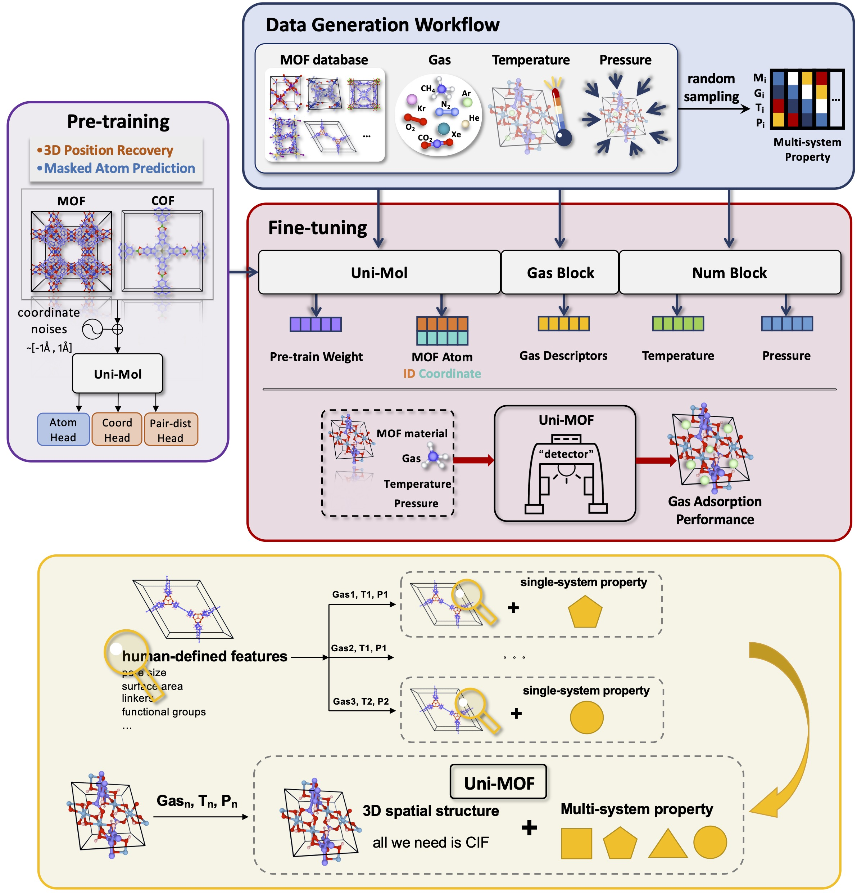

# Uni-MOF-based-on-PaddlePaddle

**Uni-MOF: A comprehensive transformer-based approach for high-accuracy gas adsorption predictions in metal-organic frameworks**

*Nature Communications* [[paper](https://www.nature.com/articles/s41467-024-46276-x)][[arXiv](https://chemrxiv.org/engage/chemrxiv/article-details/6447d756e4bbbe4bbf3afeaa)]

<b>Schematic illustration of the Uni-MOF framework</b>

## 论文概述

作者提出了一个用于**金属有机框架（MOF）材料气体吸附性能预测的通用机器学习框架——Uni-MOF**，可预测 MOF 材料在不同气体、温度和压力条件下的吸附性能，目标是作为一个“**气体吸附检测器**”。

### 背景与挑战

- MOFs 是用于气体分离的优良材料，因其可调孔径和多样化结构。
- 传统模拟方法（如分子动力学、蒙特卡洛方法）虽然准确，但计算开销极大，不适用于大规模筛选。
- 早期的机器学习方法依赖特征工程，容易过拟合，且通常只支持单一气体、固定条件预测。

### 方法创新

1. **三维结构预训练（Self-supervised learning）**：
   - 使用超 63 万个 MOF/COF 结构数据进行预训练。
   - 类似 BERT，使用原子掩码预测与三维坐标去噪任务，学习材料的空间结构特征。
2. **统一预测模型（Fine-tuning）**：
   - 结合气体种类、温度、压力进行跨系统预测。
   - 输入仅需结构的 `.cif` 文件和操作条件。
3. **数据生成与增强**：
   - 使用 ToBaCCo 3.0 程序和 GCMC 模拟生成高质量、多样化的吸附数据。

### 实验结果

- 在多个大型数据库上表现出色：
  - hMOF_MOFX_DB（R²=0.98）
  - CoRE_MOFX_DB（R²=0.92）
  - CoRE_MAP_DB（R²=0.83）
- 能准确预测不同 MOF 中的不同气体吸附量，甚至在**高压下的吸附性能**也可仅通过**低压数据预测**。
- 实验结果表明，Uni-MOF 的预测与真实实验高度一致。
- 在预测未知气体的吸附时也显示出较强的泛化能力（如 Kr 的 R²=0.85）。

### 结构特征预测与可视化

- Uni-MOF 还可预测 MOF 的结构特征，如孔径、比表面积、孔隙率等（R²>0.99）。
- 使用 t-SNE 可视化展示其学习到的结构嵌入与吸附行为的显著相关性。
